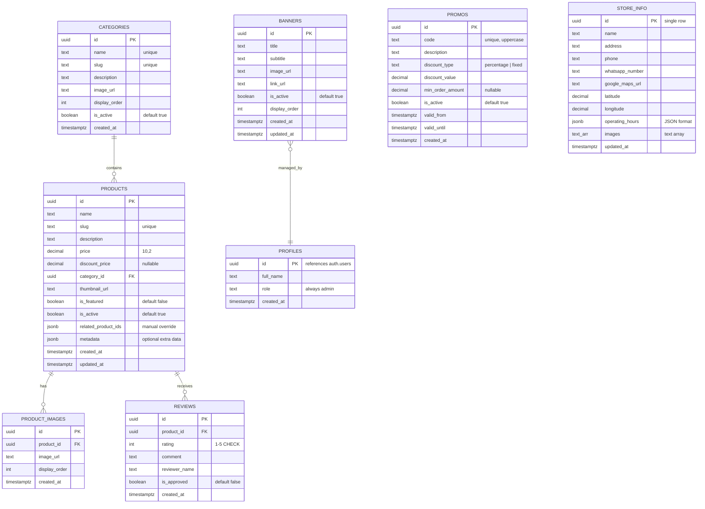

# 🌸 Moon Fleurs — Full-Stack Implementation Plan

Web florist modern full-stack menggunakan **Next.js 16**, **Tailwind CSS v4**, **shadcn/ui**, dan **Supabase** (Database, Auth, Storage).

---

## ✅ Confirmed Decisions

- **Supabase Project:** ✅ Sudah ada
- **Ordering Flow:** ✅ WhatsApp order only (bukan cart/checkout)
- **Auth:** ✅ Admin only — visitor tidak perlu login
- **Reviews:** ✅ Admin input manual, tampil di homepage sebagai Marquee
- **Wishlist:** ✅ localStorage via Zustand persist
- **Store:** ✅ Single location
- **Seed Data:** ✅ Mock data lengkap akan dibuatkan
- **Deployment:** ✅ Vercel
- **SEO:** ✅ SEO-friendly (metadata, OG tags, JSON-LD, sitemap)

---

## 🧱 Tech Stack (Final)

| Layer | Technology | Version |
|-------|-----------|---------|
| Framework | Next.js (App Router) | 16.x |
| Styling | Tailwind CSS | v4.x |
| UI Components | shadcn/ui | latest |
| Database | Supabase (PostgreSQL) | — |
| Auth | Supabase Auth (admin only) | — |
| Storage | Supabase Storage | — |
| Data Fetching | TanStack Query | v5 |
| Forms | React Hook Form + Zod | latest |
| State Management | Zustand | latest |
| HTTP/DB Client | @supabase/supabase-js + @supabase/ssr | latest |
| Icons | Lucide React | latest |
| Animations | Framer Motion | latest |
| Analytics | Google Analytics 4 + Vercel Analytics | — |

---

## 🗄️ Phase 1: Database Schema Design (Supabase)

Database di-design menggunakan PostgreSQL via Supabase SQL Editor.

### Entity Relationship Diagram



### SQL Migration Script

```sql
-- ============================================
-- 1. PROFILES (admin only — no user registration)
-- ============================================
CREATE TABLE public.profiles (
  id UUID PRIMARY KEY REFERENCES auth.users(id) ON DELETE CASCADE,
  full_name TEXT,
  role TEXT NOT NULL DEFAULT 'admin',
  created_at TIMESTAMPTZ DEFAULT now()
);

-- Auto-create profile on admin signup
CREATE OR REPLACE FUNCTION public.handle_new_user()
RETURNS TRIGGER AS $$
BEGIN
  INSERT INTO public.profiles (id, full_name)
  VALUES (
    NEW.id,
    NEW.raw_user_meta_data->>'full_name'
  );
  RETURN NEW;
END;
$$ LANGUAGE plpgsql SECURITY DEFINER;

CREATE TRIGGER on_auth_user_created
  AFTER INSERT ON auth.users
  FOR EACH ROW EXECUTE FUNCTION public.handle_new_user();

-- ============================================
-- 2. CATEGORIES
-- ============================================
CREATE TABLE public.categories (
  id UUID PRIMARY KEY DEFAULT gen_random_uuid(),
  name TEXT NOT NULL UNIQUE,
  slug TEXT NOT NULL UNIQUE,
  description TEXT,
  image_url TEXT,
  display_order INT DEFAULT 0,
  is_active BOOLEAN DEFAULT true,
  created_at TIMESTAMPTZ DEFAULT now()
);

CREATE INDEX idx_categories_slug ON public.categories(slug);
CREATE INDEX idx_categories_active ON public.categories(is_active);

-- ============================================
-- 3. PRODUCTS
-- ============================================
CREATE TABLE public.products (
  id UUID PRIMARY KEY DEFAULT gen_random_uuid(),
  name TEXT NOT NULL,
  slug TEXT NOT NULL UNIQUE,
  description TEXT,
  price DECIMAL(10, 2) NOT NULL,
  discount_price DECIMAL(10, 2),
  category_id UUID REFERENCES public.categories(id) ON DELETE SET NULL,
  thumbnail_url TEXT,
  is_featured BOOLEAN DEFAULT false,
  is_active BOOLEAN DEFAULT true,
  related_product_ids JSONB DEFAULT '[]',
  metadata JSONB DEFAULT '{}',
  created_at TIMESTAMPTZ DEFAULT now(),
  updated_at TIMESTAMPTZ DEFAULT now()
);

CREATE INDEX idx_products_slug ON public.products(slug);
CREATE INDEX idx_products_category ON public.products(category_id);
CREATE INDEX idx_products_featured ON public.products(is_featured) WHERE is_featured = true;
CREATE INDEX idx_products_active ON public.products(is_active) WHERE is_active = true;

-- ============================================
-- 4. PRODUCT IMAGES
-- ============================================
CREATE TABLE public.product_images (
  id UUID PRIMARY KEY DEFAULT gen_random_uuid(),
  product_id UUID NOT NULL REFERENCES public.products(id) ON DELETE CASCADE,
  image_url TEXT NOT NULL,
  display_order INT DEFAULT 0,
  created_at TIMESTAMPTZ DEFAULT now()
);

CREATE INDEX idx_product_images_product ON public.product_images(product_id);

-- ============================================
-- 5. REVIEWS (no user_id — visitors submit without login)
-- ============================================
CREATE TABLE public.reviews (
  id UUID PRIMARY KEY DEFAULT gen_random_uuid(),
  product_id UUID NOT NULL REFERENCES public.products(id) ON DELETE CASCADE,
  rating INT NOT NULL CHECK (rating >= 1 AND rating <= 5),
  comment TEXT,
  reviewer_name TEXT NOT NULL,
  is_approved BOOLEAN DEFAULT false,
  created_at TIMESTAMPTZ DEFAULT now()
);

CREATE INDEX idx_reviews_product ON public.reviews(product_id);
CREATE INDEX idx_reviews_approved ON public.reviews(is_approved) WHERE is_approved = true;

-- ============================================
-- 6. BANNERS
-- ============================================
CREATE TABLE public.banners (
  id UUID PRIMARY KEY DEFAULT gen_random_uuid(),
  title TEXT NOT NULL,
  subtitle TEXT,
  image_url TEXT NOT NULL,
  link_url TEXT,
  is_active BOOLEAN DEFAULT true,
  display_order INT DEFAULT 0,
  created_at TIMESTAMPTZ DEFAULT now(),
  updated_at TIMESTAMPTZ DEFAULT now()
);

-- ============================================
-- 7. STORE INFO (single row — hanya satu toko)
-- ============================================
CREATE TABLE public.store_info (
  id UUID PRIMARY KEY DEFAULT gen_random_uuid(),
  name TEXT NOT NULL,
  address TEXT NOT NULL,
  phone TEXT,
  whatsapp_number TEXT,
  google_maps_url TEXT,
  latitude DECIMAL(10, 8),
  longitude DECIMAL(11, 8),
  operating_hours JSONB DEFAULT '{}',
  images TEXT[] DEFAULT '{}',
  updated_at TIMESTAMPTZ DEFAULT now()
);

-- Insert default single store row
INSERT INTO public.store_info (name, address, phone, whatsapp_number)
VALUES ('Moon Fleurs', 'Alamat toko di sini', '08xxxxxxxxxx', '628xxxxxxxxxx');

-- ============================================
-- 8. PROMOS / VOUCHERS
-- ============================================
CREATE TABLE public.promos (
  id UUID PRIMARY KEY DEFAULT gen_random_uuid(),
  code TEXT NOT NULL UNIQUE,
  description TEXT,
  discount_type TEXT NOT NULL CHECK (discount_type IN ('percentage', 'fixed')),
  discount_value DECIMAL(10, 2) NOT NULL,
  min_order_amount DECIMAL(10, 2),
  is_active BOOLEAN DEFAULT true,
  valid_from TIMESTAMPTZ DEFAULT now(),
  valid_until TIMESTAMPTZ,
  created_at TIMESTAMPTZ DEFAULT now()
);

CREATE INDEX idx_promos_code ON public.promos(code);
CREATE INDEX idx_promos_active ON public.promos(is_active) WHERE is_active = true;

-- ============================================
-- 9. HELPER FUNCTION: is_admin()
-- ============================================
CREATE OR REPLACE FUNCTION public.is_admin()
RETURNS BOOLEAN AS $$
BEGIN
  RETURN EXISTS (
    SELECT 1 FROM public.profiles
    WHERE id = auth.uid() AND role = 'admin'
  );
END;
$$ LANGUAGE plpgsql SECURITY DEFINER;

-- ============================================
-- 10. Full-text search index for products
-- ============================================
CREATE EXTENSION IF NOT EXISTS pg_trgm;
CREATE INDEX idx_products_name_trgm ON public.products USING gin (name gin_trgm_ops);
```

### Row Level Security (RLS) Policies

```sql
-- Enable RLS on all tables
ALTER TABLE public.profiles ENABLE ROW LEVEL SECURITY;
ALTER TABLE public.categories ENABLE ROW LEVEL SECURITY;
ALTER TABLE public.products ENABLE ROW LEVEL SECURITY;
ALTER TABLE public.product_images ENABLE ROW LEVEL SECURITY;
ALTER TABLE public.reviews ENABLE ROW LEVEL SECURITY;
ALTER TABLE public.banners ENABLE ROW LEVEL SECURITY;
ALTER TABLE public.store_info ENABLE ROW LEVEL SECURITY;
ALTER TABLE public.promos ENABLE ROW LEVEL SECURITY;

-- PROFILES (admin only)
CREATE POLICY "Profiles viewable by owner"
  ON public.profiles FOR SELECT TO authenticated USING (auth.uid() = id);

-- CATEGORIES (public read, admin write)
CREATE POLICY "Categories viewable by everyone"
  ON public.categories FOR SELECT USING (true);
CREATE POLICY "Admin can manage categories"
  ON public.categories FOR ALL TO authenticated USING (public.is_admin());

-- PRODUCTS (public read active, admin full access)
CREATE POLICY "Active products viewable by everyone"
  ON public.products FOR SELECT USING (is_active = true);
CREATE POLICY "Admin can manage products"
  ON public.products FOR ALL TO authenticated USING (public.is_admin());

-- PRODUCT_IMAGES (public read, admin write)
CREATE POLICY "Product images viewable by everyone"
  ON public.product_images FOR SELECT USING (true);
CREATE POLICY "Admin can manage product images"
  ON public.product_images FOR ALL TO authenticated USING (public.is_admin());

-- REVIEWS (public read approved, admin-only CRUD)
CREATE POLICY "Approved reviews viewable by everyone"
  ON public.reviews FOR SELECT USING (is_approved = true);
CREATE POLICY "Admin can manage all reviews"
  ON public.reviews FOR ALL TO authenticated USING (public.is_admin());

-- BANNERS (public read active, admin manage)
CREATE POLICY "Active banners viewable by everyone"
  ON public.banners FOR SELECT USING (is_active = true);
CREATE POLICY "Admin can manage banners"
  ON public.banners FOR ALL TO authenticated USING (public.is_admin());

-- STORE_INFO (public read, admin update — single row)
CREATE POLICY "Store info viewable by everyone"
  ON public.store_info FOR SELECT USING (true);
CREATE POLICY "Admin can update store info"
  ON public.store_info FOR UPDATE TO authenticated USING (public.is_admin());

-- PROMOS (public read active, admin manage)
CREATE POLICY "Active promos viewable by everyone"
  ON public.promos FOR SELECT USING (is_active = true AND (valid_until IS NULL OR valid_until > now()));
CREATE POLICY "Admin can manage promos"
  ON public.promos FOR ALL TO authenticated USING (public.is_admin());
```

### Supabase Storage Buckets

```sql
-- Create storage buckets (no avatars — no user accounts)
INSERT INTO storage.buckets (id, name, public) VALUES ('products', 'products', true);
INSERT INTO storage.buckets (id, name, public) VALUES ('banners', 'banners', true);
INSERT INTO storage.buckets (id, name, public) VALUES ('stores', 'stores', true);

-- Storage policies: public read, admin upload
CREATE POLICY "Public read access" ON storage.objects
  FOR SELECT USING (bucket_id IN ('products', 'banners', 'stores'));
CREATE POLICY "Admin upload access" ON storage.objects
  FOR INSERT TO authenticated WITH CHECK (public.is_admin());
CREATE POLICY "Admin update access" ON storage.objects
  FOR UPDATE TO authenticated USING (public.is_admin());
CREATE POLICY "Admin delete access" ON storage.objects
  FOR DELETE TO authenticated USING (public.is_admin());
```

---

## 🏗️ Phase 2: Project Initialization

### 2.1 Create Next.js Project

```bash
npx -y create-next-app@latest ./ --typescript --tailwind --eslint --app --src-dir --turbopack
```

### 2.2 Install Dependencies

```bash
# Supabase
npm install @supabase/supabase-js @supabase/ssr

# UI Components
npx shadcn@latest init

# Data Fetching
npm install @tanstack/react-query

# Forms & Validation
npm install react-hook-form @hookform/resolvers zod

# State Management
npm install zustand

# Icons
npm install lucide-react

# Animations (scroll reveal, stagger, page transitions)
npm install framer-motion

# Analytics
npm install @vercel/analytics @vercel/speed-insights

# Utilities
npm install clsx tailwind-merge date-fns slugify
```

### 2.3 shadcn/ui Components

```bash
npx shadcn@latest add button card input label textarea select dialog sheet table badge separator avatar dropdown-menu navigation-menu carousel skeleton toast tabs alert-dialog form switch popover
```

### 2.4 Environment Variables

```env
# .env.local
NEXT_PUBLIC_SUPABASE_URL=your_supabase_url
NEXT_PUBLIC_SUPABASE_ANON_KEY=your_supabase_anon_key
NEXT_PUBLIC_SITE_URL=http://localhost:3000
NEXT_PUBLIC_GA_MEASUREMENT_ID=G-XXXXXXXXXX
# WhatsApp number diambil dari table store_info (bukan env)
```

---

## 📁 Phase 3: Project Structure

```text
src/
├── app/
│   ├── layout.tsx                   # Root layout (fonts, QueryProvider, metadata)
│   ├── page.tsx                     # Homepage
│   ├── loading.tsx                  # Global loading
│   ├── not-found.tsx                # 404 page
│   │
│   ├── products/
│   │   ├── page.tsx                 # Product listing
│   │   └── [slug]/
│   │       └── page.tsx             # Product detail
│   │
│   ├── categories/
│   │   └── [slug]/
│   │       └── page.tsx             # Products by category
│   │
│   ├── store/
│   │   └── page.tsx                 # Store info (single location)
│   │
│   ├── wishlist/
│   │   └── page.tsx                 # Wishlist page (localStorage)
│   │
│   ├── auth/
│   │   ├── login/
│   │   │   └── page.tsx             # Login page (admin only)
│   │   └── callback/
│   │       └── route.ts             # Auth callback handler
│   │
│   ├── (admin)/                     # Route group: admin panel
│   │   ├── layout.tsx               # Admin layout + auth guard
│   │   ├── admin/
│   │   │   ├── page.tsx             # Dashboard + analytics
│   │   │   ├── products/
│   │   │   │   ├── page.tsx         # Product list
│   │   │   │   ├── new/
│   │   │   │   │   └── page.tsx     # Create product
│   │   │   │   └── [id]/
│   │   │   │       └── edit/
│   │   │   │           └── page.tsx # Edit product
│   │   │   ├── categories/
│   │   │   │   ├── page.tsx         # Category list
│   │   │   │   └── new/
│   │   │   │       └── page.tsx     # Create category
│   │   │   ├── banners/
│   │   │   │   ├── page.tsx         # Banner list
│   │   │   │   └── new/
│   │   │   │       └── page.tsx     # Create banner
│   │   │   ├── reviews/
│   │   │   │   └── page.tsx         # Review CRUD
│   │   │   ├── promos/
│   │   │   │   ├── page.tsx         # Promo/voucher list
│   │   │   │   └── new/
│   │   │   │       └── page.tsx     # Create promo
│   │   │   └── store/
│   │   │       └── page.tsx         # Edit store info (single form)
│   │   └── _components/
│   │       ├── admin-sidebar.tsx
│   │       ├── admin-header.tsx
│   │       ├── data-table.tsx
│   │       └── dashboard-stats.tsx  # Analytics summary cards
│   │
│   └── api/
│       ├── revalidate/
│       │   └── route.ts             # On-demand revalidation
│       └── search/
│           └── route.ts             # Product search API (autocomplete)
│
├── components/
│   ├── ui/                          # shadcn/ui (auto-generated)
│   ├── providers/
│   │   ├── query-provider.tsx       # TanStack Query provider
│   │   └── theme-provider.tsx       # Theme provider (optional)
│   ├── layout/
│   │   ├── navbar.tsx
│   │   ├── footer.tsx
│   │   ├── mobile-nav.tsx
│   │   └── container.tsx
│   ├── home/
│   │   ├── hero-banner.tsx
│   │   ├── featured-products.tsx
│   │   ├── category-showcase.tsx
│   │   ├── review-marquee.tsx        # Marquee auto-scroll testimonials
│   │   ├── store-preview.tsx         # Store location preview (map + info)
│   │   └── cta-section.tsx
│   ├── product/
│   │   ├── product-card.tsx         # Card + wishlist + share button
│   │   ├── product-grid.tsx
│   │   ├── product-detail.tsx
│   │   ├── product-gallery.tsx
│   │   ├── category-filter.tsx
│   │   ├── price-range-filter.tsx   # Dual-handle price slider
│   │   ├── search-autocomplete.tsx  # Search with dropdown suggestions
│   │   ├── share-button.tsx         # Share to social media + copy link
│   │   ├── related-products.tsx     # Smart related products section
│   │   └── whatsapp-order-btn.tsx
│   ├── wishlist/
│   │   ├── wishlist-button.tsx       # Heart toggle button (reusable)
│   │   └── wishlist-grid.tsx         # Wishlist product grid
│   ├── shared/
│   │   └── whatsapp-fab.tsx          # Floating WhatsApp button (global)
│   ├── store/
│   │   ├── store-map.tsx            # Embedded Google Maps
│   │   └── store-info.tsx           # Store details (alamat, jam, kontak)
│   └── review/
│       └── review-card.tsx          # Used in marquee + admin
│
├── lib/
│   ├── supabase/
│   │   ├── client.ts                # Browser Supabase client
│   │   ├── server.ts                # Server Supabase client
│   │   └── middleware.ts            # Supabase middleware client
│   ├── utils.ts                     # cn(), formatPrice(), etc.
│   ├── constants.ts                 # App constants
│   └── validations/
│       ├── product.ts               # Zod schema for products
│       ├── banner.ts                # Zod schema for banners
│       ├── category.ts              # Zod schema for categories
│       ├── review.ts                # Zod schema for reviews
│       └── promo.ts                 # Zod schema for promos
│
├── hooks/
│   ├── use-products.ts              # TanStack Query: products
│   ├── use-categories.ts            # TanStack Query: categories
│   ├── use-banners.ts               # TanStack Query: banners
│   ├── use-reviews.ts               # TanStack Query: reviews
│   ├── use-promos.ts                # TanStack Query: promos
│   ├── use-store-info.ts            # TanStack Query: store info (single)
│   ├── use-search.ts                # Debounced search hook
│   └── use-auth.ts                  # Auth state hook
│
├── stores/
│   ├── app-store.ts                 # Zustand (UI state, filters, price range)
│   └── wishlist-store.ts            # Zustand + persist (wishlist in localStorage)
│
├── types/
│   ├── database.ts                  # Supabase auto-generated types
│   ├── product.ts
│   ├── category.ts
│   ├── banner.ts
│   ├── review.ts
│   ├── promo.ts
│   └── store-info.ts
│
└── styles/
    └── globals.css                  # Tailwind v4 + Design System

middleware.ts                        # Root middleware (Supabase session refresh)
```

---

## 🎨 Phase 4: Design System (Tailwind CSS v4)

### [MODIFY] `src/styles/globals.css`

```css
@import "tailwindcss";

@theme {
  /* Typography */
  --font-sans: "Inter", ui-sans-serif, system-ui, sans-serif;
  --font-serif: "Playfair Display", serif;

  /* Brand Colors */
  --color-primary: #D4956A;
  --color-primary-hover: #C0845D;
  --color-primary-light: #E8B896;
  --color-primary-dark: #A87350;

  /* Text Colors */
  --color-text-primary: #504641;
  --color-text-secondary: #8B7D76;
  --color-text-muted: #A89890;

  /* Background Colors */
  --color-bg-main: #FFFCF9;
  --color-bg-accent: #FBEDE0;
  --color-bg-card: #FFFFFF;
  --color-bg-muted: #F5F0EB;

  /* Border Colors */
  --color-border: #E8DDD6;
  --color-border-light: #F0E8E2;

  /* Semantic Colors */
  --color-success: #6B9B76;
  --color-warning: #D4A04A;
  --color-danger: #C75D5D;
  --color-info: #5B8DB8;

  /* Shadows */
  --shadow-card: 0 2px 8px rgba(80, 70, 65, 0.06);
  --shadow-card-hover: 0 8px 24px rgba(80, 70, 65, 0.12);

  /* Spacing */
  --spacing-section: 5rem;

  /* Border Radius */
  --radius-sm: 0.375rem;
  --radius-md: 0.5rem;
  --radius-lg: 1rem;
  --radius-xl: 1.5rem;

  /* Transitions */
  --transition-base: 200ms ease;
  --transition-smooth: 300ms cubic-bezier(0.4, 0, 0.2, 1);
}
```

---

## 🔌 Phase 5: Supabase Integration Layer

### 5.1 Supabase Clients

#### [NEW] `src/lib/supabase/client.ts` — Browser Client
```typescript
import { createBrowserClient } from '@supabase/ssr'
import type { Database } from '@/types/database'

export function createClient() {
  return createBrowserClient<Database>(
    process.env.NEXT_PUBLIC_SUPABASE_URL!,
    process.env.NEXT_PUBLIC_SUPABASE_ANON_KEY!
  )
}
```

#### [NEW] `src/lib/supabase/server.ts` — Server Client
- Creates Supabase client for Server Components & Server Actions
- Uses `cookies()` from `next/headers`
- Typed with Database types

#### [NEW] `middleware.ts` — Session Refresh
- Refreshes Supabase auth session on every request
- Protects `/admin/*` routes → redirect to `/auth/login` if not authenticated
- Checks admin role for admin routes

### 5.2 TypeScript Types (Auto-generated)

```bash
npx supabase gen types typescript --project-id <project-id> > src/types/database.ts
```

### 5.3 TanStack Query Hooks

Setiap hook menggunakan Supabase client langsung (bukan Axios):

#### [NEW] `src/hooks/use-products.ts`
```typescript
// useProducts(filters?) → query daftar produk + join category
// useProduct(slug) → query single produk + images + category
// useCreateProduct() → mutation insert product + images
// useUpdateProduct() → mutation update product
// useDeleteProduct() → mutation delete product
// useFeaturedProducts() → query featured products
```

#### [NEW] `src/hooks/use-categories.ts`
```typescript
// useCategories() → query all active categories
// useCategory(slug) → single category
// useCategoryProducts(slug) → products in category
// admin mutations: create, update, delete
```

Pattern serupa untuk `use-banners.ts`, `use-reviews.ts`.

#### [NEW] `src/hooks/use-store-info.ts`
```typescript
// useStoreInfo() → query single store row
// useUpdateStoreInfo() → mutation update store info (admin only)
```

### 5.4 Zod Validations

#### [NEW] `src/lib/validations/product.ts`
```typescript
import { z } from 'zod'

export const productSchema = z.object({
  name: z.string().min(3, 'Nama minimal 3 karakter'),
  price: z.number().positive('Harga harus lebih dari 0'),
  discount_price: z.number().positive().optional().nullable(),
  category_id: z.string().uuid('Pilih kategori'),
  description: z.string().optional(),
  is_featured: z.boolean().default(false),
  is_active: z.boolean().default(true),
})
```

---

## 📄 Phase 6: Pages & Components

### 6.1 Layout Components

| Component | Detail |
|-----------|--------|
| `navbar.tsx` | Logo, nav links (Home, Products, Store, Reviews), wishlist icon with count badge, mobile drawer, sticky + backdrop blur |
| `footer.tsx` | Contact info, social media, quick links, WhatsApp, copyright |
| `mobile-nav.tsx` | Sheet drawer with full navigation |
| `container.tsx` | Max-width wrapper (1280px) |

### 6.2 Homepage (`/`)

| Section | Component | Data Source |
|---------|-----------|-------------|
| Hero Banner | `hero-banner.tsx` | `banners` table (active, ordered) |
| Featured Products | `featured-products.tsx` | `products` where `is_featured = true` (limit 8) |
| Category Showcase | `category-showcase.tsx` | `categories` (active, ordered) |
| Customer Testimonials | `review-marquee.tsx` | `reviews` where `is_approved = true` — **Marquee** infinite horizontal scroll |
| Store Location | `store-preview.tsx` | `store_info` table — mini map embed, alamat, jam buka, WhatsApp button |
| CTA / WhatsApp | `cta-section.tsx` | Static + WhatsApp link from env |

### 6.3 Product Pages

#### `/products` — Product Listing
- Server Component: fetch initial products with SSR
- **Search with Autocomplete** — debounced input, dropdown suggestions dari `pg_trgm` full-text search
- Client-side filter: category, **price range slider** (min-max), sort (price, newest)
- Infinite scroll dengan TanStack Query `useInfiniteQuery`
- Skeleton loading state
- Responsive grid: 2→3→4 columns
- Active promo banner strip (jika ada promo aktif)

#### `/products/[slug]` — Product Detail
- Server Component: fetch product + images + category (SSR + SEO)
- Image gallery: main image + thumbnails
- Price display (with discount jika ada)
- **Promo badge** jika ada voucher aktif yang berlaku
- Category badge
- **Wishlist button** (add/remove heart toggle)
- **Share button** — Web Share API (WhatsApp, Facebook, copy link) + share analytics
- WhatsApp order button (pre-filled message dengan info produk + kode promo jika ada)
- **Smart Related Products** — same category + similar price range, atau admin manual override
- Dynamic OG metadata

#### `/categories/[slug]` — Category Products
- Reuse product grid
- Category header + description
- Breadcrumbs

### 6.4 Store Location (`/store`) — Single Location
- Hero section dengan gambar toko
- Info lengkap: nama, alamat, nomor telepon
- Jam operasional (formatted dari JSON)
- Embedded Google Maps (iframe dari `google_maps_url`)
- WhatsApp button langsung ke nomor toko
- Gallery foto toko

### 6.5 Wishlist (`/wishlist`) — NEW
- Grid of wishlisted products (dari localStorage)
- Remove from wishlist button
- Empty state jika belum ada wishlist
- Link ke product detail
- WhatsApp order button per item
- **Data flow:** Zustand store + `persist` middleware → localStorage

### 6.6 Reviews — Homepage Marquee Only
- **Tidak ada halaman `/reviews` terpisah** — reviews hanya tampil di homepage
- Marquee style: infinite horizontal auto-scroll, pause on hover
- Dua baris marquee bergerak berlawanan arah (kiri ↔ kanan) untuk efek dinamis
- Review card: nama reviewer, rating stars, komentar singkat
- Data dari `reviews` table where `is_approved = true`
- CSS animation `@keyframes marquee` — pure CSS, tanpa library tambahan

### 6.7 Auth (`/auth/login`) — Admin Only
- Admin login form (email + password)
- Supabase Auth `signInWithPassword`
- Redirect to `/admin` on success
- Tidak ada link register — admin dibuat manual di Supabase dashboard
- Simple, minimal design

### 6.9 WhatsApp Floating Button (Global)
- Fixed position bottom-right, semua halaman (kecuali admin)
- Pulse animation untuk menarik perhatian
- Klik → buka WhatsApp dengan pesan default
- Nomor diambil dari `store_info.whatsapp_number`
- Hidden saat sudah ada WhatsApp order button di viewport (product detail)

### 6.10 Admin Panel (`/admin/*`)

#### Admin Layout
- Sidebar: Dashboard, Products, Categories, Banners, Reviews, Promos, Store Info
- Header: admin name, logout button
- Middleware: redirect to login if not admin
- Responsive: sidebar → drawer on mobile

#### Dashboard (`/admin`) — With Analytics
- **Summary cards**: total products, categories, active banners, active promos
- **Quick stats**: total wishlist adds (from GA4 events), total WhatsApp clicks
- **Top Products**: most viewed products (from analytics)
- **Top Wishlisted**: most wishlisted products
- Quick action buttons (add product, add promo)
- Recent activity log

#### Product Management (`/admin/products`)
- Data table: image, name, price, category, status, actions
- Search + filter
- Create/Edit form: React Hook Form + Zod
- Image upload to Supabase Storage
- Multiple product images support
- **Related products selector** — manual override, pilih produk terkait
- Delete with confirmation dialog
- Toast notifications

#### Category Management (`/admin/categories`)
- List with image preview
- Create/Edit form
- Auto-generate slug from name
- Reorder (display_order)

#### Banner Management (`/admin/banners`)
- Grid/list view with image preview
- Active/inactive toggle
- Create/Edit with image upload
- Reorder

#### Review Management (`/admin/reviews`)
- Data table: reviewer name, rating, comment, status, date, actions
- **CRUD penuh** — admin yang input review (bukan user)
- Create form: nama reviewer, rating, komentar, pilih produk (optional)
- Edit existing reviews
- Toggle approved/unapproved
- Delete with confirmation

#### Promo / Voucher Management (`/admin/promos`) — NEW
- Data table: code, discount type, value, validity, status, actions
- Create form:
  - Kode promo (auto-uppercase)
  - Tipe diskon: persentase (%) atau nominal (Rp)
  - Nilai diskon
  - Minimum order (optional)
  - Tanggal berlaku (from-until)
  - Status aktif/nonaktif
- Edit + delete existing promos
- Expired promos auto-marked (visual indicator)

#### Store Info (`/admin/store`) — Edit Only
- Single edit form (tidak ada list/create/delete — hanya 1 toko)
- Fields: nama, alamat, phone, WhatsApp, Google Maps URL, lat/lng
- Operating hours editor (visual JSON editor)
- Store images upload

---

## 📋 Execution Order

| # | Phase | Tasks | Est. Time |
|---|-------|-------|-----------|
| 1 | **Project Init** | Create Next.js project, install deps, shadcn init | 30 min |
| 2 | **Database** | SQL migrations (incl. promos table, pg_trgm), RLS, storage | 45 min |
| 3 | **Supabase Layer** | Client/server setup, middleware, generate types | 30 min |
| 4 | **Design System** | Tailwind v4 theme, global styles, fonts | 20 min |
| 5 | **Layout** | Navbar, footer, mobile nav, WhatsApp FAB, container | 1.5 hr |
| 6 | **Data Layer** | Types, Zod validations, TanStack Query hooks, search hook | 2 hr |
| 7 | **Homepage** | Hero, featured, categories, marquee, store preview, CTA | 2 hr |
| 8 | **Products** | Listing + search autocomplete + price filter + detail + share | 3 hr |
| 9 | **Categories** | Category page, filter, breadcrumbs | 1 hr |
| 10 | **Store** | Store info page, maps, gallery | 1 hr |
| 11 | **Auth** | Login page, auth callback, middleware protection | 1 hr |
| 12 | **Admin Layout** | Sidebar, header, auth guard, dashboard analytics | 1.5 hr |
| 13 | **Admin CRUD** | Products (+ related), categories, banners, reviews, promos, store | 4.5 hr |
| 14 | **SEO** | Metadata, OG tags, JSON-LD, sitemap, robots.txt | 1 hr |
| 15 | **Analytics** | GA4 + Vercel Analytics + share tracking + custom events | 45 min |
| 16 | **Seed Data** | Mock products, categories, reviews, banners, promos, store | 30 min |
| 17 | **Polish** | Animations, responsive, 404 page, loading states | 1 hr |
| 18 | **Deployment** | Vercel setup, env vars, build verification | 30 min |

**Total estimated: ~18 hours**

---

## 🔍 Phase 7: SEO Strategy

Semua halaman harus SEO-friendly dengan implementasi berikut:

### 7.1 Next.js Metadata API

```typescript
// src/app/layout.tsx — Global metadata
export const metadata: Metadata = {
  title: {
    default: 'Moon Fleurs — Toko Bunga Modern',
    template: '%s | Moon Fleurs',
  },
  description: 'Moon Fleurs menyediakan rangkaian bunga segar dan elegan untuk berbagai momen spesial. Pesan via WhatsApp.',
  keywords: ['toko bunga', 'florist', 'rangkaian bunga', 'bunga segar', 'Moon Fleurs'],
  authors: [{ name: 'Moon Fleurs' }],
  openGraph: {
    type: 'website',
    locale: 'id_ID',
    siteName: 'Moon Fleurs',
  },
}
```

### Per-Page Metadata

| Page | Title | Description |
|------|-------|-------------|
| `/` | Moon Fleurs — Toko Bunga Modern | Landing page description |
| `/products` | Katalog Bunga \| Moon Fleurs | Semua produk bunga |
| `/products/[slug]` | `{product.name}` \| Moon Fleurs | Dynamic dari product data |
| `/categories/[slug]` | `{category.name}` \| Moon Fleurs | Dynamic dari category data |
| `/store` | Lokasi Toko \| Moon Fleurs | Alamat & info toko |
| `/wishlist` | Wishlist Saya \| Moon Fleurs | `noindex` (private page) |

### 7.2 Dynamic OG Images
- Product detail pages: OG image = product thumbnail
- Category pages: OG image = category image
- Homepage: OG image = custom branded image

### 7.3 JSON-LD Structured Data

```typescript
// Homepage: Organization + WebSite schema
// Product detail: Product schema (name, price, image, availability)
// Store page: LocalBusiness schema (address, phone, openingHours)
// Product listing: ItemList schema
```

### 7.4 Technical SEO

#### [NEW] `src/app/sitemap.ts`
```typescript
// Dynamic sitemap generated from Supabase
// — All active product pages
// — All active category pages  
// — Static pages (home, store, wishlist)
export default async function sitemap(): Promise<MetadataRoute.Sitemap> { ... }
```

#### [NEW] `src/app/robots.ts`
```typescript
// Allow all crawlers
// Disallow: /admin/*, /auth/*
// Sitemap: https://domain.com/sitemap.xml
export default function robots(): MetadataRoute.Robots { ... }
```

#### Performance SEO
- Next.js Image component (`next/image`) untuk semua gambar — otomatis lazy loading + WebP
- Server Components untuk SSR — content ready saat crawler visit
- Static generation untuk halaman yang jarang berubah
- `loading.tsx` untuk setiap route segment

---

## 🌱 Phase 8: Seed Data (Mock)

Data mock untuk development dan demo. Dijalankan via Supabase SQL Editor.

### Categories (8)

| # | Name | Slug |
|---|------|------|
| 1 | Buket Bunga | buket-bunga |
| 2 | Bunga Meja | bunga-meja |
| 3 | Bunga Standing | bunga-standing |
| 4 | Bunga Papan | bunga-papan |
| 5 | Bunga Pernikahan | bunga-pernikahan |
| 6 | Bunga Duka Cita | bunga-duka-cita |
| 7 | Tanaman Hias | tanaman-hias |
| 8 | Bunga Artificial | bunga-artificial |

### Products (16 — 2 per category)

Contoh produk per kategori:
- **Buket Bunga**: "Rosé Elegance" (Rp 350.000), "Sunset Bloom" (Rp 450.000)
- **Bunga Meja**: "Petite Garden" (Rp 275.000), "Crystal Vase Lily" (Rp 400.000)
- **Bunga Standing**: "Grand Opening Joy" (Rp 850.000), "Celebration Tower" (Rp 1.200.000)
- **Bunga Papan**: "Selamat & Sukses" (Rp 650.000), "Happy Wedding Board" (Rp 750.000)
- dsb.

Setiap produk akan memiliki:
- 2-3 gambar (placeholder dari Supabase Storage)
- Deskripsi lengkap
- Beberapa produk di-mark sebagai `is_featured = true`
- Beberapa dengan `discount_price`

### Reviews (10)

Contoh review yang sudah di-approve:
- "Bunganya cantik sekali, pengiriman cepat!" ⭐⭐⭐⭐⭐ — Sari W.
- "Rangkaian bunga meja sangat elegan" ⭐⭐⭐⭐⭐ — Andi P.
- "Buket anniversary istri suka banget" ⭐⭐⭐⭐ — Budi R.
- dsb.

### Banners (3)
- Banner 1: "Koleksi Bunga Terbaru" — hero image buket
- Banner 2: "Promo Spesial Bulan Ini" — discount banner
- Banner 3: "Custom Bouquet" — CTA ke WhatsApp

### Store Info (1)
- Nama: Moon Fleurs
- Alamat: Jl. Bunga Mawar No. 123, Jakarta Selatan
- Phone: (021) 1234-5678
- WhatsApp: 6281234567890
- Operating hours: Sen-Sab 08:00-20:00, Minggu 09:00-17:00
- Google Maps URL: (placeholder embed URL)

---

## 📊 Phase 10: Analytics

### 10.1 Vercel Analytics (Performance)

```tsx
// src/app/layout.tsx
import { Analytics } from '@vercel/analytics/next'
import { SpeedInsights } from '@vercel/speed-insights/next'

export default function RootLayout({ children }) {
  return (
    <html>
      <body>
        {children}
        <Analytics />
        <SpeedInsights />
      </body>
    </html>
  )
}
```

Tracked otomatis:
- Page views
- Web Vitals (LCP, CLS, FID, TTFB)
- Top pages & referrers

### 10.2 Google Analytics 4 (Traffic & Behavior)

```tsx
// src/components/providers/google-analytics.tsx
import Script from 'next/script'

export function GoogleAnalytics() {
  const gaId = process.env.NEXT_PUBLIC_GA_MEASUREMENT_ID
  if (!gaId) return null

  return (
    <>
      <Script src={`https://www.googletagmanager.com/gtag/js?id=${gaId}`} strategy="afterInteractive" />
      <Script id="gtag-init" strategy="afterInteractive">
        {`window.dataLayer = window.dataLayer || [];
          function gtag(){dataLayer.push(arguments);}
          gtag('js', new Date());
          gtag('config', '${gaId}');`}
      </Script>
    </>
  )
}
```

### 10.3 Custom Event Tracking

Events yang di-track:

```typescript
// WhatsApp order click
gtag('event', 'whatsapp_order', {
  product_name: 'Rosé Elegance',
  product_price: 350000,
  category: 'Buket Bunga',
})

// Wishlist add/remove
gtag('event', 'wishlist_add', { product_name: '...' })
gtag('event', 'wishlist_remove', { product_name: '...' })

// Product view
gtag('event', 'view_item', { product_name: '...', price: ... })

// Category view
gtag('event', 'view_category', { category_name: '...' })

// Share product (with platform tracking)
gtag('event', 'share', {
  method: 'whatsapp' | 'facebook' | 'twitter' | 'copy_link',
  content_type: 'product',
  item_id: '...',
  product_name: '...',
})

// Search
gtag('event', 'search', { search_term: '...' })

// Promo view
gtag('event', 'view_promo', { promo_code: '...', discount: '...' })
```

---

## 🚀 Phase 11: Vercel Deployment

### 9.1 Vercel Project Setup

Setup via **Vercel Dashboard** ([vercel.com](https://vercel.com)):
1. Import Git repository
2. Framework preset: Next.js (auto-detected)
3. Set environment variables
4. Deploy

### 9.2 Environment Variables (Vercel Dashboard)

```
NEXT_PUBLIC_SUPABASE_URL=https://xxx.supabase.co
NEXT_PUBLIC_SUPABASE_ANON_KEY=eyJhbGci...
NEXT_PUBLIC_SITE_URL=https://moonfleurs.vercel.app
```

### 9.3 next.config.ts

```typescript
// Image domains: Supabase Storage
const nextConfig = {
  images: {
    remotePatterns: [
      {
        protocol: 'https',
        hostname: '*.supabase.co',
        pathname: '/storage/v1/object/public/**',
      },
    ],
  },
}
```

### 9.4 Deployment Checklist
- [ ] Environment variables set di Vercel
- [ ] `npm run build` passes locally
- [ ] Supabase RLS policies verified
- [ ] Sitemap accessible at `/sitemap.xml`
- [ ] Robots.txt accessible at `/robots.txt`
- [ ] OG images render correctly (check via [opengraph.xyz](https://opengraph.xyz))
- [ ] Admin login works on production
- [ ] WhatsApp links open correctly

---


## Verification Plan

### Automated Tests
```bash
npm run build          # Build check — no errors
npm run lint           # ESLint
npx tsc --noEmit       # TypeScript check
```

### SEO Verification
- ✅ `/sitemap.xml` accessible and lists all pages
- ✅ `/robots.txt` blocks `/admin/*` and `/auth/*`
- ✅ Every page has unique `<title>` and `<meta description>`
- ✅ Product pages have JSON-LD `Product` schema
- ✅ Store page has JSON-LD `LocalBusiness` schema
- ✅ OG images render correctly (verify via opengraph.xyz)
- ✅ Heading hierarchy: single `<h1>` per page
- ✅ All images use `next/image` with alt text
- ✅ Lighthouse SEO score ≥ 90

### Browser Testing
- ✅ Homepage renders all sections (hero, products, categories, marquee reviews, CTA)
- ✅ Product listing + filter + search + infinite scroll
- ✅ Product detail + image gallery + wishlist button
- ✅ Store location page + maps
- ✅ Wishlist page (add/remove from localStorage)
- ✅ Review marquee auto-scrolls, pauses on hover
- ✅ WhatsApp order buttons generate correct pre-filled messages
- ✅ Admin login flow
- ✅ Admin CRUD operations (products, banners, categories, reviews)
- ✅ Image upload ke Supabase Storage
- ✅ RLS policies bekerja (non-admin tidak bisa akses admin data)
- ✅ Responsive di mobile, tablet, desktop
- ✅ Loading states & error handling

### Deployment Verification
- ✅ `npm run build` passes
- ✅ Vercel preview deployment works
- ✅ Environment variables properly set
- ✅ Supabase connection works on production
- ✅ Admin login works on production URL
